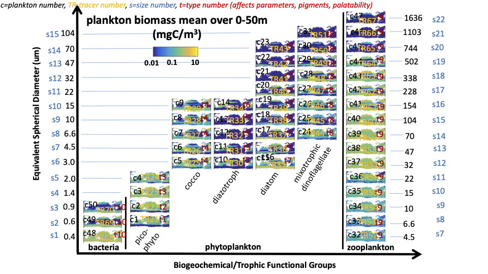

# Tracers 

## Nutrients TRAC01-TRAC20

Tracer ID - Tracer Name - Nutrient
 - 1 - TRAC01 - DIC
 - 2 - TRAC02 - NO3
 - 3 - TRAC03 - NO2
 - 4 - TRAC04 - NH4
 - 5 - TRAC05 - PO4
 - 6 - TRAC06 - FeT
 - 7 - TRAC07 - SiO2 
 - 8 - TRAC08 - DOC
 - 9 - TRAC09 - DON
 - 10 - TRAC10 - DOP
 - 11 - TRAC11 - DOFe
 - 12 - TRAC12 - POC
 - 13 - TRAC13 - PON
 - 14 - TRAC14 - POP
 - 15 - TRAC15 - POFe
 - 16 - TRAC16 - POSi
 - 17 - TRAC17 - PIC
 - 18 - TRAC18 - ALK
 - 19 - TRAC19 - O2
 - 20 - TRAC20 - CDOM

## Biomass TRAC21-TRAC70 

Refer to the chart for size classes, functional groups, and grazing preferences

Grouping - Tracer ID numbers - plankton number
- pico - 21:24 - c1 to c4
- cocco - 25:29 - c5 to c9
- diazotrophs - 30:34 - c10 to c14
- diatoms - 35:43 - c15 to c23
- mixotophic dinoflagellates - 44:51 - c24 to c31
- zooplankton - 52:67 - c32 to c47
- heterotrophic bacteria - 68:70 - c48 to c50

All tracer names are in the form "TRAC[ID]" where [ID] is the tracer ID number. 

# Diagnostic Files 

A description of the files that are saved to the `ecco_gud_DATE` directory underneath `darwin3/verification/dar_one_config/run/[config_name]/run`

- **3d** file
    - tracer abundances
        - nutrients
        - plankton
- **par** file 
    - PAR (sunlight) levels
- **GR** file
    - grazing loss of each plankton
- **GRGN** file 
    - grazing gain for each plankton
- **PC** file 
    - carbon-specific phototrophic growth rate for c1-c4
- **PP** file
    - primary production for each plankton
- **chl** file 
    - chlorophyll concentration for c1-c31 (autotrophic phytoplankton)

More diagnostics can be added! Submit a github issue request or email birdy@mit.edu. 

