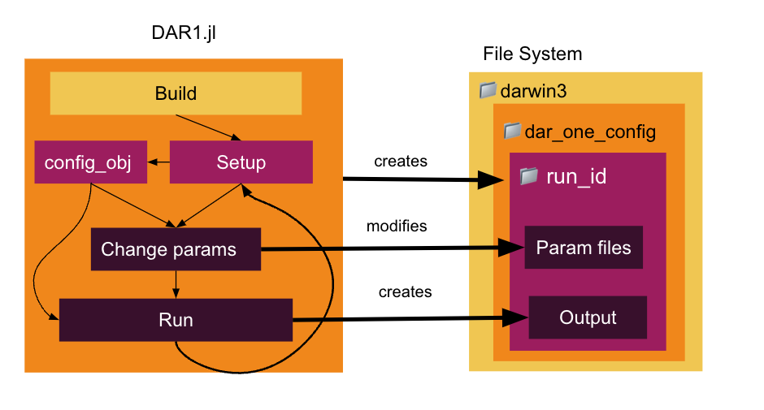

# Getting Started 

DAR1 is a tool for designing and running experiments simulating the marine microbiome within a single cube of water. The biogeochemical forcing is powered by the [MIT Darwin Model](https://darwinproject.mit.edu/), and DAR1 provides a Julia interface to build, configure, and run experiments with a simple, streamlined workflow. 

# Basic Structure 

DAR1 is composed of three main parts: the MITgcm Darwin code, a configuration made for DAR1, and the julia interface to modify the configuration and run the model. 

- [DAR1](https://github.com/barbara42/Dar_One) - Julia interface for organizing experiments and setting up parameters for model runs 
    - `MITgcm_path` variable needs to point to darwin3
- [darwin3](https://github.com/darwinproject/darwin3) - MITgcm source code set up to include all things Darwin 
    - `dar_one_config` - folder for the base configuration files for DAR1, which lives in the darwin3/verification/ folder. ([DAR1_config github](https://github.com/barbara42/dar_one_config))

Experiments are designed and run in a Julia file using the DAR1 Julia interface. This will create a unique run folder nested underneath the MITgcm darwin code and the dar_one_config folder. You will never have to look at the fortran of MITgcm Darwin or at the configuration files! However, output of the experiment is saved underneath that unique run folder that is created in `darwin3/verification/dar_one_config/run`.

# Installation 

DAR1 can be run in one of two ways. 
1) In a **docker container** using the DAR1_docker image, where all dependencies are handled for you 
2) On your local machine, where you have to set up the environment, download dependencies, etc 
    - this is more time consuming, and I strongly recommend using the docker image
    - instructions for local setup are below

## Setting up with docker

(1) Download and install [docker desktop](https://www.docker.com/).
- Run the docker application, which will start up the docker "daemon" 
- The docker daemon must be running in order to download the DAR1 image and to start up a container

(2) Get the [DAR1_docker image](https://hub.docker.com/repository/docker/birdy1123/dar1).
- using the command line, run 

    `docker pull birdy1123/dar1`

- If you go to the "Images" tab in the docker desktop UI, you should see "birdy1123/DAR1_docker"

(3) Run a container based on the DAR1_docker image
- using the command line, run 

    `docker run -it birdy1123/dar1` 
- this runs the container in interactive mode (`-i`) with terminal access (`-t`) 
- you should see the prompt change to `root@some-number:/dar_one_docker#`
- once the container is running, you can also connect to a new bash terminal inside the container using the command `docker exec -it container_id /bin/bash`. The container id can be found in the Docker desktop app or the "some-number" that appears in the previous bullet point. 

You're now ready for the [beginner tutorial](https://barbara42.github.io/Dar_One/build/beginner_tutorials/)!

## Setting up on local machine

In depth instructions coming soon :) 

# Workflow

